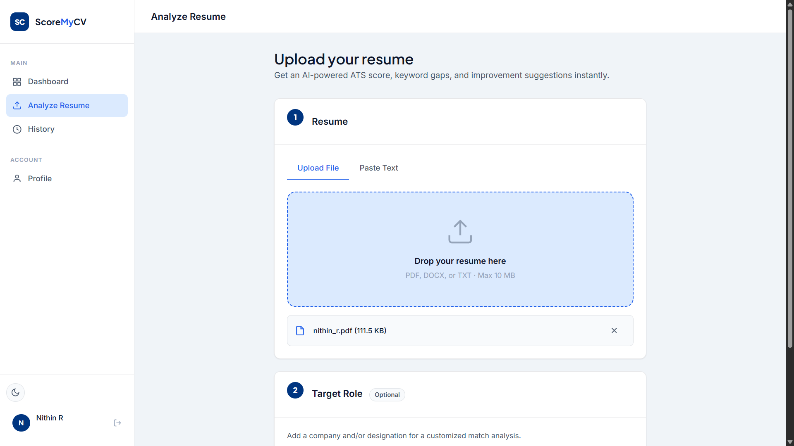
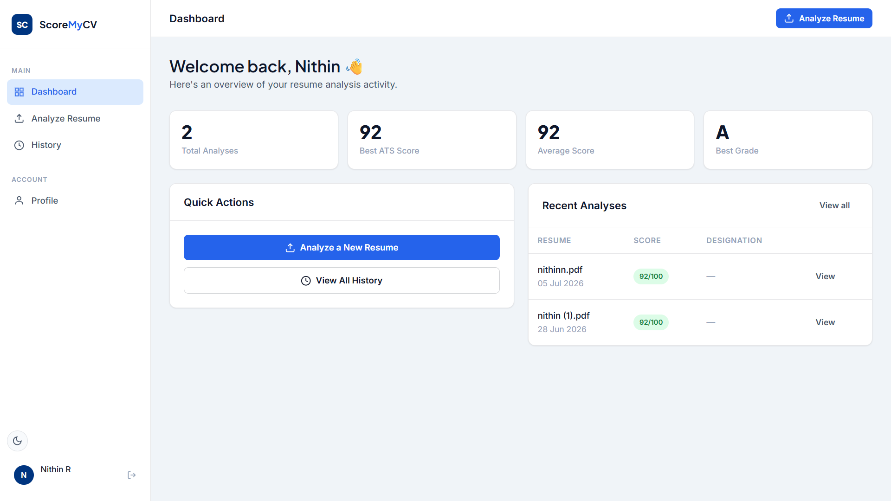

# ScoreMyCV 🎯

An AI-powered ATS Resume Analyzer that scores your resume against a job description and gives detailed feedback to help you land more interviews.

**Live Demo:** [scoremycv-p3g9.onrender.com](https://scoremycv-p3g9.onrender.com)

---

## Screenshots

### Landing Page


### Login Page


### Upload Resume


### ATS Result & Score


### Dashboard


### Scan History


---

## Features

- 📄 Upload resume as PDF or DOCX
- 🤖 AI-powered ATS scoring using Groq LLaMA 3.3 70B
- 📊 Radar chart with detailed score breakdown
- 🔑 Keyword match analysis
- 📥 Download report as PDF or DOCX
- 🔐 Google OAuth + Email/Password authentication
- 📱 Fully responsive on mobile and tablet
- 🕓 Scan history for all previous analyses

---

## Tech Stack

| Layer | Technology |
|-------|-----------|
| Backend | Flask (Python 3.11) |
| Frontend | HTML, CSS, JavaScript |
| Database | Supabase (PostgreSQL) |
| Auth | Supabase Auth + Google OAuth |
| AI | Groq API (LLaMA 3.3 70B) |
| Deployment | Render |
| PDF/DOCX | pdfplumber, python-docx, ReportLab |

---

## Project Structure
scoremycv/
├── app.py                  # Flask app entry point
├── routes/
│   ├── auth.py             # Authentication routes
│   ├── analysis.py         # AI analysis routes
│   ├── resume.py           # Resume upload routes
│   ├── report.py           # Report generation
│   └── admin.py            # Admin panel
├── utils/
│   ├── supabase_client.py  # Supabase connection
│   ├── groq_client.py      # Groq AI client
│   ├── extractor.py        # PDF/DOCX text extraction
│   └── jwt_util.py         # JWT token utilities
├── templates/              # Jinja2 HTML templates
├── static/                 # CSS, JS, assets
├── supabase_schema.sql     # Database schema with RLS
├── requirements.txt
└── Procfile

---

## Setup & Installation

### 1. Clone the repository
```bash
git clone https://github.com/nithinr8265/ScoreMyCV.git
cd ScoreMyCV
```

### 2. Create virtual environment
```bash
python -m venv venv
venv\Scripts\activate  # Windows
source venv/bin/activate  # Mac/Linux
```

### 3. Install dependencies
```bash
pip install -r requirements.txt
```

### 4. Set up environment variables
```bash
cp .env.example .env
# Fill in your values in .env
```

### 5. Run the app
```bash
python app.py
```

---

## Environment Variables

```env
FLASK_SECRET_KEY=your-secret-key
SUPABASE_URL=https://your-project.supabase.co
SUPABASE_KEY=your-supabase-anon-key
GROQ_API_KEY=your-groq-api-key
JWT_SECRET_KEY=your-jwt-secret
APP_URL=http://127.0.0.1:5000
```

---

## Team

| Name | Role |
|------|------|
| Nithin | Backend — Flask routes, AI integration, deployment |
| Swathi | Frontend — UI/CSS, database schema, templates |

---

